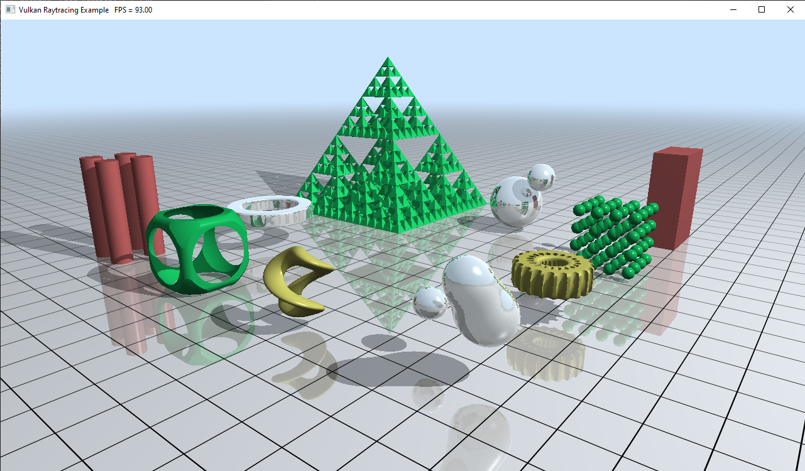

# Vulkan Raytracing Procedural Geometry Sample

Vulkan port of the D3D12 Procedural Geometry Demo [WIP]

This sample uses the new VK_KHR_ray_tracing extension. It was ported from the before adapted sample for [VK_NV_ray_tracing](https://github.com/DerRM/VulkanRaytracingProceduralGeometry/tree/VK_NV_ray_tracing).

This sample demonstrates how to implement procedural geometry using intersection shaders. It utilizes multiple intersections shaders to create analytic and volumetric, signed distance and fractal geometry. In addition, it introduces:

	- Extended shader table layouts and indexing covering multiple geometries and bottom-level acceleration structures (bottom-level AS, or BLAS for short).
	- Use of trace ray recursion and two different ray types: radiance and shadow rays.
	- It also serves as a cross reference between D3D12 DXR style API calls and Vulkan as it directly adapts the [D3D12 Raytracing Procedural Geometry sample](https://github.com/microsoft/DirectX-Graphics-Samples/blob/master/Samples/Desktop/D3D12Raytracing/src/D3D12RaytracingProceduralGeometry/readme.md)